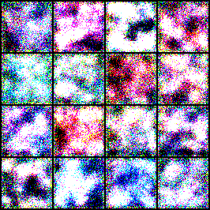
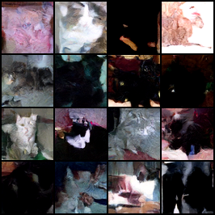
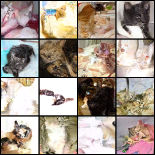
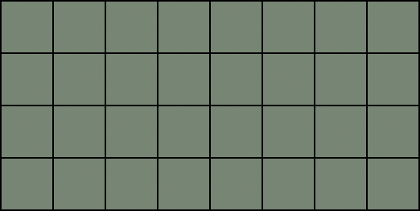
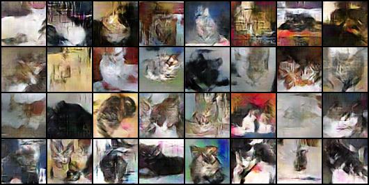
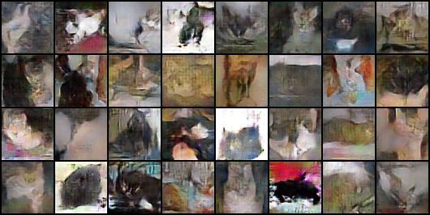
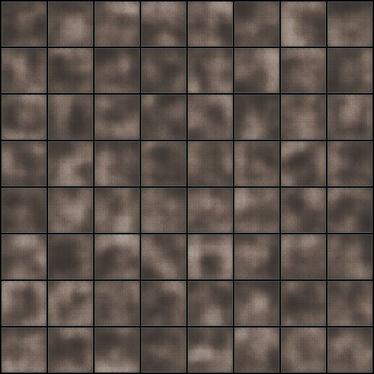
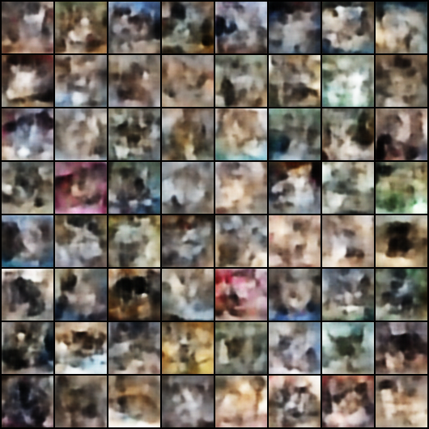
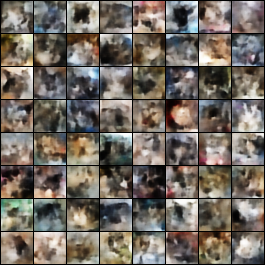

# Cat Image Synthesis

This project explores generating images of cats using three different generative models:
- **DDPM** (Denoising Diffusion Probabilistic Models)
- **GAN** (Generative Adversarial Networks / WGAN-GP)
- **VAE** (Variational Autoencoder)

## Training Progress Samples

Below are generated samples from each model taken at various epochs during training, demonstrating how the generation quality improves over time.

### DDPM (Diffusion)

| Epoch 0 | Epoch 200 | Epoch 400 |
|:---:|:---:|:---:|
|  |  |  |

### GAN

| Epoch 0 | Epoch 200 | Epoch 400 |
|:---:|:---:|:---:|
|  |  |  |

### VAE

| Epoch 0 | Epoch 200 | Epoch 400 |
|:---:|:---:|:---:|
|  |  |  |

## Data and Checkpoints

*Note: The raw dataset and the trained model checkpoints (.pth) are not included directly in this repository due to GitHub's file size limits.*

## Reproducible Preprocessing

The raw Crawford cat dataset should be placed under `data/raw/cats/`. The preprocessing script scans recursively, so the original `CAT_00` ... `CAT_06` subfolders can stay intact.

```powershell
python scripts/preprocess_data.py --input data/raw/cats --output data/processed/cats_64.npy --preview
```

Training scripts accept `--seed` and `--deterministic` for reproducibility. Example:

```powershell
python scripts/train_vae.py --data data/processed/cats_64.npy --seed 42 --deterministic
```

## Week 3: Evaluation and Interpolation

Compute FID for the available checkpoints:

```powershell
python scripts/evaluate_fid.py --models vae gan ddpm --num-samples 512 --save-samples
```

For final reporting, increase `--num-samples` if time allows. DDPM sampling is slow, so it is fine to use a smaller sample count during development.

Generate the required 10-image latent interpolation grid, including the two endpoints and 8 intermediate latents:

```powershell
python scripts/latent_interpolation.py --model vae --steps 10 --seed 42
```

The script writes both the image grid and the latent vectors to `outputs/interpolation/`.

## Week 4: Cats vs Dogs Exploratory Experiment

The slides suggest the Kaggle Dogs vs Cats competition dataset:

```powershell
python scripts/prepare_cats_dogs.py --dogs-zip path\to\dogs-vs-cats.zip --build-npy --preview
```

This creates `data/raw/dogs/` and `data/processed/cats_dogs_64.npy`. Retrain one model from scratch into a separate folder so the cat-only checkpoints are preserved:

```powershell
python scripts/train_gan.py --data data/processed/cats_dogs_64.npy --epochs 50 --checkpoint-dir checkpoints/gan_cats_dogs --samples-dir outputs/gan_cats_dogs/samples --seed 42
```

Treat this as an exploratory extension: compare sample grids qualitatively and note whether generations look class-distinct or become cat/dog hybrids.
